# swiftui

Projects / Topics                                                                                                                                                            | Screenshots
---                                                                                                                                                                          |---
[Project 1](01-Project1) - *WeSplit*  (with challenges)                                           Form, Section, NavigationView, @State property wrapper, TextField, Picker, ForEach  |  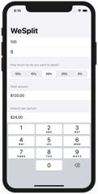 |
[Project 2](03-Project2) - *Guess the Flag*  (with challenges)                                           VStack, Image, Alert  | 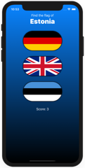 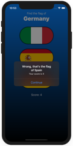 |
[Project 3](04-Project3) - *View and Modifiers*  (with challenges)                                           Views, modifiers, composition, containers  | 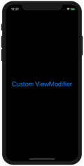 |
[Milestone Projects 1-3](05-Milestone-Projects1-3) - *Rock Paper Scissors*  |   |
[Project 4](06-Project4) - *BetterRest*  (with challenges)                                           Machine Learning, Dates (DatePicker, DateComponents, DateFormatter) Stepper, navigationBarItems()  | 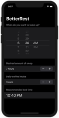 |
[Project 5](07-Project5) - *Word Scramble*  (with challenges)                                           List, onAppear, Bundle, fatalError(), UITextChecker  | 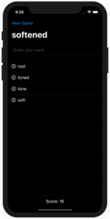 |
[Project 6](08-Project6) - *Animations*  (with challenges)                                           Animations and transitions  |  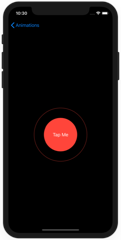
[Milestone Projects 4-6](09-Milestone-Projects4-6) - *Multiplication Tables*  | 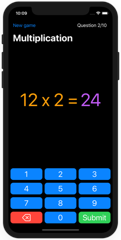 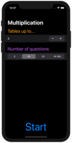 |
[Project 7](10-Project7) - *iExpense*  (with challenges)                                           UserDefaults, Codable, sheet(), onDelete(), @ObservedObject  | 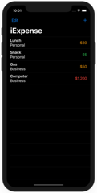 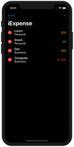
[Project 8](11-Project8) - *Moonshot*  (with challenges)                                           GeometryReader, ScrollView, Navigation, Codable hierarchy, Generics  | 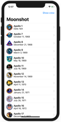  
[Project 9](12-Project9) - *Drawing*  (with challenges)                                           Paths, shapes, strokes, transforms, drawing groups, animating values, Core Animation, Metal  | 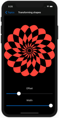 
[Milestone Projects 7-9](13-Milestone-Projects7-9) - *Habit Tracker*  | 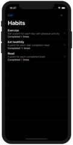 
[Project 10](14-Project10) - *Cupcakes Corner*  (with challenges)                                           Codable, URLSession, disabled()  | 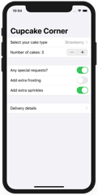 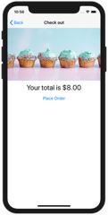 |
[Project 11](15-Project11) - *Bookworm*  (with challenges)                                           Core Data, @Binding, Custom components  | 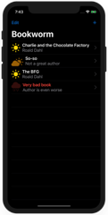 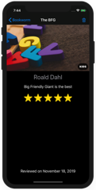 |
[Project 12](16-Project12) - *Core Data*  (with challenges)                                           Core Data  |  |
[Milestone Projects 10-12](17-Milestone-Projects10-12) - *Users listing*  | 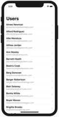 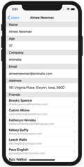  |
[Project 13](18-Project13) - *Instafilter*  (with challenges)                                           UIKit integration, Core Image, Custom bindings, Action Sheets  | 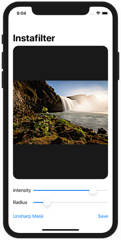 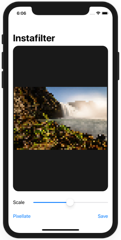 |
[Project 14](19-Project14) - *Bucket List*  (with challenges)                                           MapKit, Biometric authentication, Secure data writing, Comparable custom types, Documents directory  | 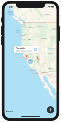 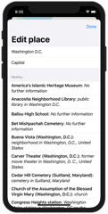 |
[Project 15](20-Project15) - *Accessibility*  (with challenges)                                         Accessibility  |  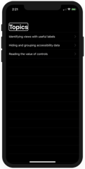 |
[Milestone Projects 13-15](21-Milestone-Projects13-15) - *Event Contacts*  | 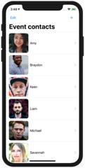  
[Project 16](22-Project16) - *Hot Prospects*  (with challenges)                                         Custom environment objects, Tab Views, Result, objectWillChange, Image interpolation, Context menus, Local notifications, Swift package dependencies, filter(), map()  | 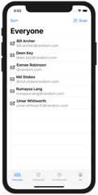 
[Project 17](23-Project17) - *Flashzilla*  (with challenges)                                         Gestures, haptics, Combine, timers, accessibility  | 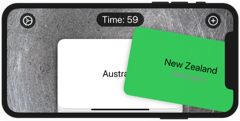 
